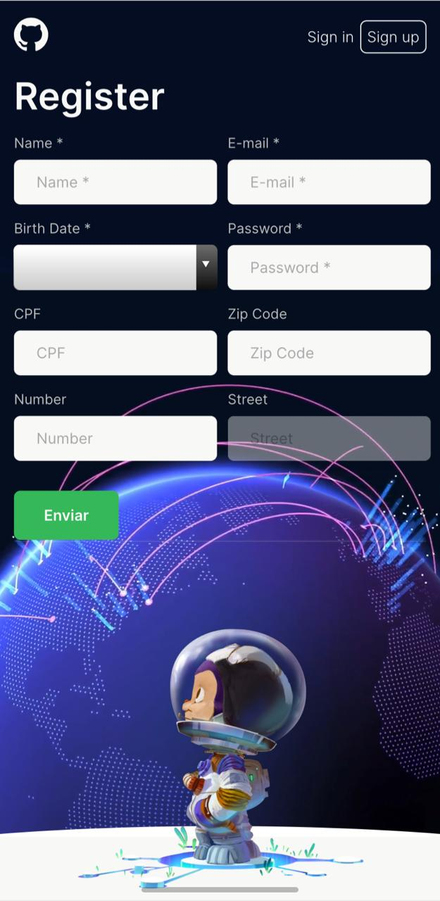
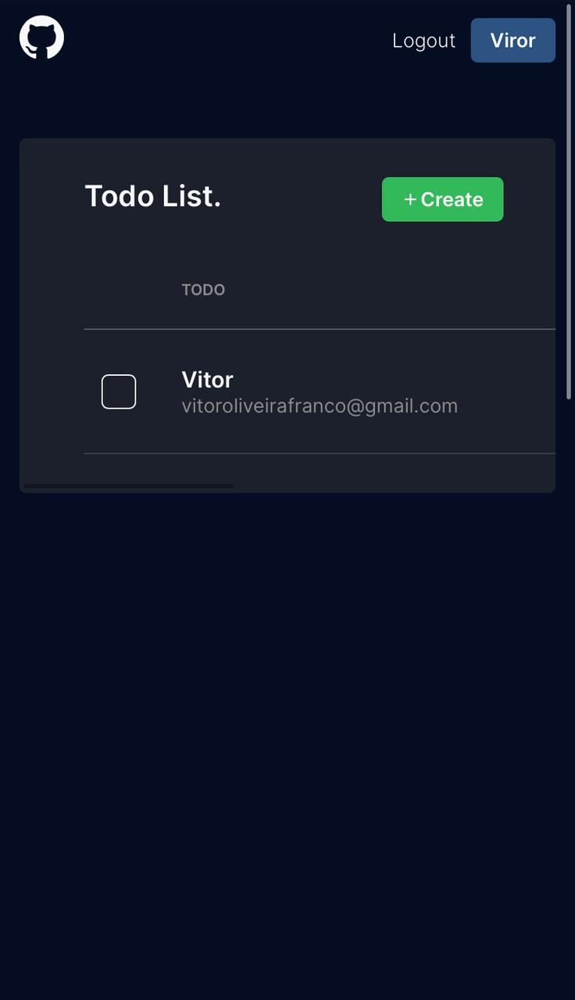
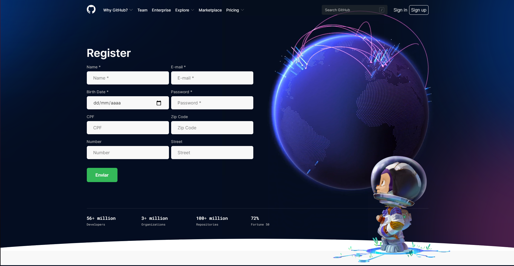
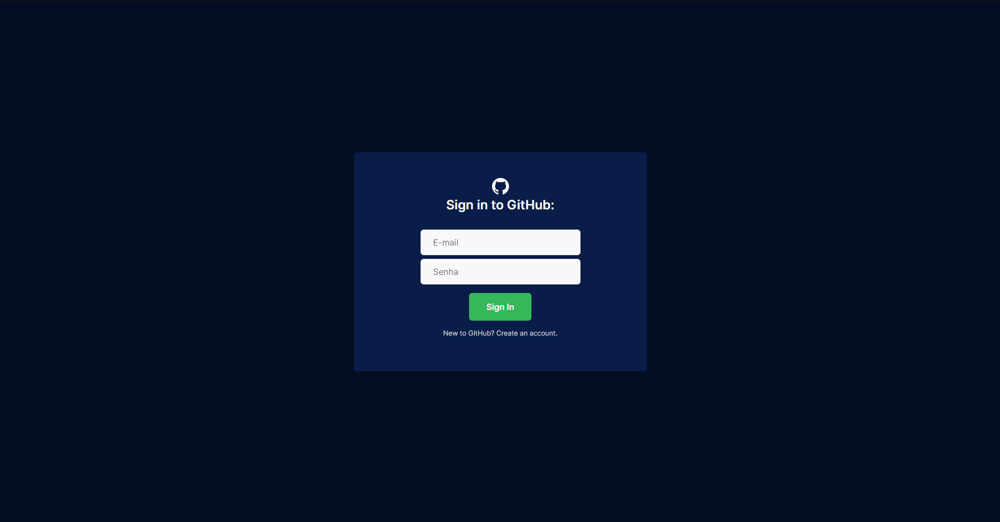
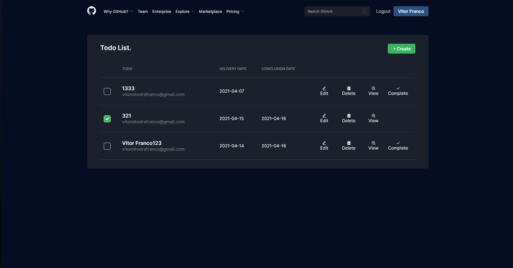

<h1 align="center">Verzel | TaskHub</h1>

<p align="center">Todo List para se organizar.</p>

<p align="center">
  
</p>

<p align="center">
  <a href="#-preview">Preview</a>&nbsp;&nbsp;&nbsp;|&nbsp;&nbsp;&nbsp;
  <a href="#-tecnologias">Tecnologias</a>&nbsp;&nbsp;&nbsp;|&nbsp;&nbsp;&nbsp;
  <a href="#-getting-started">Getting started</a>&nbsp;&nbsp;&nbsp;|&nbsp;&nbsp;&nbsp;
  <a href="#-projeto">Projeto</a>&nbsp;&nbsp;&nbsp;|&nbsp;&nbsp;&nbsp;
  <a href="#-license">Licença</a>
</p>

<h4 align="center"> 
	 TaskHub | Finalizado
</h4>

## Preview
Você pode acessar o preview da aplicação [aqui](https://taskhub.vercel.app/).

[*TaskHub | Preview*](https://taskhub.vercel.app/)
## 🚀 Getting started
### Pré-requisitos

Antes de começar, você vai precisar ter instalado em sua máquina as seguintes ferramentas:
[Git](https://git-scm.com), [Node.js](https://nodejs.org/en/).
Além disto é bom ter um editor para trabalhar com o código, como o [VSCode](https://code.visualstudio.com/)

### Rodando o projeto

```bash
# Clone este repositório
$ git clone <git@github.com:Vitor-Franco/taskhub-test-practice.git>

# Acesse a pasta do projeto no terminal/cmd
$ cd taskhub-test-practice

# Instale as dependências
$ npm install

# Execute a aplicação em modo de desenvolvimento
$ npm run start

# O servidor inciará na porta:3000 - acesse <http://localhost:3000>
```

## 🧪 Tecnologias

Este projeto utiliza as seguintes principais tecnologias:

- [React](https://pt-br.reactjs.org/)
- [React Icons](https://react-icons.github.io/react-icons/)
- [React Router Dom](https://github.com/ReactTraining/react-router/tree/master/packages/react-router-dom)
- [Redux](https://redux.js.org/)
- [Redux-Persist](https://github.com/rt2zz/redux-persist)
- [Styled Components](https://styled-components.com/)
- [Unform + Yup](https://unform.dev/)

Entre outras...

## 📝Projeto
TaskHub possibilita a criação de TodoLists, junto a um sistema de Login para que cada usuário possa **editar, excluir, visualizar e concluir** apenas as suas próprias Tasks.

Sua interface, principalmente a homepage baseia-se totalmente na Home do GitHub. E traz junto a ela um formulário para cadastro.


## Layout

Confira o layout da aplicação:

### Mobile

<p align="center">
  

  

  
</p>

### Web

<p align="center" style="display: flex; flex-direction:column; align-items: center; justify-content: center;">
  

  

  
</p>


## License
projeto licenciado pelo MIT.

---

<p align="center">Made with 💜 by Vitor Franco</p>
